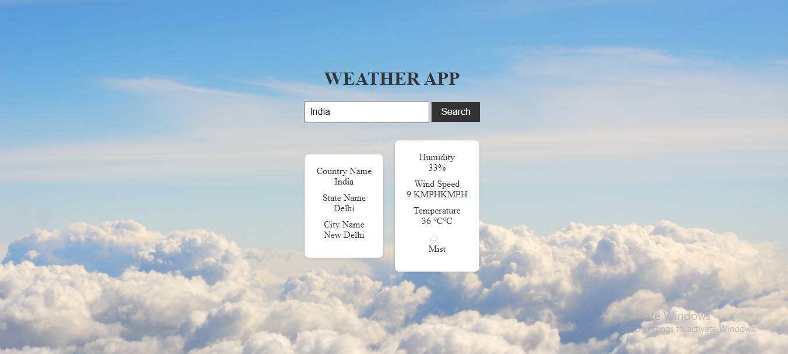

# Weather App

The Weather App is a simple web application that allows users to search for weather information based on city names. It retrieves real-time weather data using the WeatherAPI and displays the weather details for the specified city.

## Features

- Search for weather information by entering a city name.
- Displays the country, state, and city name.
- Shows the current weather conditions, including humidity, wind speed, and temperature.
- Includes an animated cloud background for visual appeal.

## How to Use

1. Clone the repository or download the source code.

2. Obtain an API key from the WeatherAPI website. (Replace `YOUR_API_KEY` in the code with your actual API key.)

3. Open the `index.html` file in a web browser.

4. Enter a city name in the input box and click the "Search" button.

5. The weather information for the specified city will be displayed on the page.

## Technologies Used

- HTML
- CSS
- JavaScript

## Dependencies

- WeatherAPI (Get your API key from [WeatherAPI](https://www.weatherapi.com/))

## Output

## License

The Weather App is licensed under the [MIT License](LICENSE).
